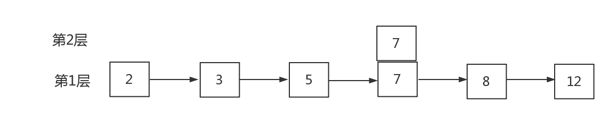

# 跳跃表

Redis使用跳跃表作为有序集合键的底层实现之一，如果一个有序集合包含的元素数量比较多，又或者有序集合中元素的成员（member）是比较长的字符串时，Redis就会使用跳跃表来作为有序集合键的底层实现。它在添加、删除、查找节点上都拥有与红黑树相当的性能，它其实说白了就是一种**特殊的链表**，链表的每个节点存了不同的“层”信息，用这种分层存节点的方式在查找节点时能跳过些节点，从而使添加、删除、查找操作都拥有了O(logN)的平均时间复杂度。最坏时间复杂度为O(N).

Redis只在两个地方用到了跳跃表，一个是实现有序集合键，另一个是在集群节点中用作内部数据结构，除此之外，跳跃表在Redis里面没有其他用途。

下面简单介绍一下跳跃表：

**跳跃表最低层(第一层)是一个拥有跳跃表所有节点的普通链表**，每次在往跳跃表插入链表节点时一定会插入到这个最低层，至于是否插入到上层就由抛硬币决定(这么说不是很准确，redis里这个概率是1/4而非1/2，为了表述方便先这么说)，什么意思呢？假设已经有一个跳跃表，其高度只有一层：


往表中插入节点“7”时，假设插入7时抛硬币的结果是正，则在第二层中插入“7”节点，继续抛一次看看还能不能上到第三层，为反则停止插入，上层不再插入“7”节点了：



同理插入“4”节点假设连续抛两次都抛了正面，第三次抛了反面，则“4”节点会插入到2、3层：


这就是跳跃表最基本的样子。

查找一个节点时，我们只需从高层到低层，一个个链表查找，每次找到该层链表中小于等于目标节点的最大节点，直到找到为止。由于高层的链表迭代时会“跳过”低层的部分节点，所以跳跃表会比正常的链表查找少查部分节点，这也是skiplist名字的由来。

假如我们需要查找节点“5”：
先遍历最高层，发现第三层头结点的下一个节点是“4”，4<5，所以游标定位到“4”节点，但是“4”节点的下一个节点是空，得继续往低层走；第二层也从“4”节点开始，“4”节点在第二层的下一个节点是“7”，7>5，公交车做过头了，回来依旧定位在“4”节点；继续往低层走，第一层“4”节点的下一个节点是“5”，这就找到了。

[](https://segmentfault.com/img/remote/1460000013418479)

事实上插入前也需要进行跳跃表查找操作，上文演示的插入流程只是直接用了链表而省略了这一步。
跳跃表有了个大概的了解，接下来我们细说redis里的skiplist.

## zskiplist相关的结构体声明

redis的skiplist有两个主要的数据结构，

* zskiplistNode：skiplist的节点
* zskiplist：用于保存跳跃表的节点数量，指向表头节点和表尾节点的指针等相关信息

在redis 4.0.1版本中zskiplistNode和zskiplist定义在server.h中，并非redis3.0中的redis.h中.

### zskiplistNode的定义

```c
typedef struct zskiplistNode {
    /* redis3.0版本中使用robj类型表示，但是在redis4.0.1中直接使用sds类型表示 */
    // 成员对象
    sds ele;

    // 分值
    double score;

    // 后退指针, 用于zrevrange命令
    struct zskiplistNode *backward;

    /*************************************************
     * 这里该成员是一种柔性数组，只是起到了占位符的作用,在sizeof(struct zskiplistNode)的时候根本就不占空间,这和sdshdr结构的定义是类似的(sds.h文件);
     * 如果想要分配一个struct zskiplistNode大小的空间，那么应该的分配的大小为sizeof(struct zskiplistNode) + sizeof(struct zskiplistLevel) * count)。
     * 其中count为柔性数组中的元素的数量
     *************************************************/
    struct zskiplistLevel {

        /* 对应level的下一个节点 */
        struct zskiplistNode *forward;

        /* 从当前节点到下一个节点的跨度 */
        unsigned int span;

    } level[];

} zskiplistNode;
```

backward变量是特意为**zrevrange***系列命令准备的，目的是为了使跳跃表实现反向遍历，普通跳跃表的实现里是非必要的。

level变量记录了此节点各层的信息:

* `level[x]->forward`表示**该节点在第x层的下一个节点**。跳跃表节点都会出现在最低层的链表里，所以都会有level[0]，通过`level[0]->forward`实现跳跃表正向遍历，**zrange***系列命令就是以此实现的。
* `level[x]->span`表示**该节点到第x层的下一个节点跳跃了多少节点**。span主要是为了**zrank、zrevrank**服务，普通跳跃表的实现里是非必要的。

### zskiplist的定义

```c
typedef struct zskiplist {

    /* 跳跃表的头节点和尾节点，尾节点的存在主要是为了能够快速定位出当前跳跃表的最后一个节点，实现反向遍历 */
    struct zskiplistNode *header, *tail;

    /* 表中节点的数量，保留这个字段的主要目的是可以再O(1)时间内获取跳跃表的长度 */
    unsigned long length;

    // 表中层数最大的节点的层数。但是不包括头结点，头结点的level永远都是最大的值--ZSKIPLIST_MAXLEVEL = 32。
    // level的值随着跳跃表中节点的插入和删除随时动态调整
    int level;

} zskiplist;
```

zskiplist的头结点不是一个有效的节点，它有**ZSKIPLIST_MAXLEVEL**层(32层)，每层的forward指向该层跳跃表的第一个节点，若没有则为null。
***btw***:跳跃表节点的层数限制在了32，若想超过32层得连续32次抛硬币都得到正面，这得有足够多的节点，redis限定了抛硬币正面的概率为1/4，所以到达32层的概率为**(1/2)^64**，一般一台64位的计算机能拥有的最大内存也无法存储这么多zskiplistNode，所以对于基本使用32层的上限已经足够高了。

最终zskiplist内存布局如下:

[](https://segmentfault.com/img/remote/1460000013418480)

也可以去掉不必要的部分(backward、obj)，作出如下抽象后的图：

[](https://segmentfault.com/img/remote/1460000013418481)

下文我们都通过简化图来分析跳跃表的基本操作流程。

## zskiplist相关接口

### 创建一个zskiplist 时间复杂度O(1)

创建一个zskiplist就是创建一个高度为ZSKIPLIST_MAXLEVEL(32)的头结点，score为0，member为null。
代码如下：

```c
/* Create a new skiplist. */
zskiplist *zslCreate(void) {
    int j;
    zskiplist *zsl;

    zsl = zmalloc(sizeof(*zsl));
    zsl->level = 1;
    zsl->length = 0;
    zsl->header = zslCreateNode(ZSKIPLIST_MAXLEVEL,0,NULL); // 32level的头结点
    for (j = 0; j < ZSKIPLIST_MAXLEVEL; j++) {
        // 头结点每个level的下一个节点都初始化为null，跨度为0
        zsl->header->level[j].forward = NULL;
        zsl->header->level[j].span = 0;
    }
    zsl->header->backward = NULL;
    zsl->tail = NULL;
    return zsl;
}

/* Create a skiplist node with the specified number of levels.
 * The SDS string 'ele' is referenced by the node after the call. */
// 为指定高度的节点分配空间并赋值，insert操作也要用到
zskiplistNode *zslCreateNode(int level, double score, sds ele) {
    zskiplistNode *zn =
        zmalloc(sizeof(*zn)+level*sizeof(struct zskiplistLevel));
    zn->score = score;
    zn->ele = ele;
    return zn;
}
```

执行完zslCreate后会得到如下布局:

[](https://segmentfault.com/img/remote/1460000013418482)

### zskiplist插入一个节点 时间复杂度O(logn)

插入一个节点时需要做以下工作:

1. 找到合适的插入位置
2. 调用zslRandomLevel得到要插入的节点的层数
3. 调用zslCreateNode根据节点层数,member,score创建一个节点
4. 修改插入位置前后节点以及插入节点本身的backward,forward,span等属性.

要找到新节点的插入位置，只需像上文介绍的那样，从高层向低层找即可。在找的过程中用`update[]`数组记录每一层插入位置的上一个节点，用`rank[]`数组记录每一层插入位置的上一个节点在跳跃表中的排名。根据`update[]`插入新节点，插入完成后再根据`rank[]`更新跨度信息即可。
ps:redis允许节点有重复的score，当score相同时根据member(代码里的obj指向的字符串)的字典序来排名。

```c
/* Returns a random level for the new skiplist node we are going to create.
 * The return value of this function is between 1 and ZSKIPLIST_MAXLEVEL
 * (both inclusive), with a powerlaw-alike distribution where higher
 * levels are less likely to be returned. */
int zslRandomLevel(void) {//返回一个随机的层数，不是level的索引是层数
    int level = 1;
    while ((random()&0xFFFF) < (ZSKIPLIST_P * 0xFFFF))//有1/4的概率加入到上一层中
        level += 1;
    return (level<ZSKIPLIST_MAXLEVEL) ? level : ZSKIPLIST_MAXLEVEL;
}

//根据score、member插入一个节点到某个zskiplist中
//调用这个函数前需要确认obj(member)还不在跳跃表里，避免重复插入
zskiplistNode *zslInsert(zskiplist *zsl, double score, robj *obj) {
    zskiplistNode *update[ZSKIPLIST_MAXLEVEL], *x;//每一层的最后一个小于score的节点，因为插入节点需要修改每一层这个节点的上一个节点的信息(跨度)，所以得保留一下，更重要的，这是保留插入位置
    unsigned int rank[ZSKIPLIST_MAXLEVEL];//记录每一层插入节点的上一个节点在skiplist中的排名
    int i, level;//变量i作为zslInsert函数里循环的索引值,变量level为插入节点的层数(不是层数的索引）

    serverAssert(!isnan(score));//isnan是一个macro，用于判断参数是否是NAN(非数字)
    x = zsl->header;//x用于迭代zskiplistNode
    for (i = zsl->level-1; i >= 0; i--) {//从最高层向最底层查询，找到合适的插入位置
        /* store rank that is crossed to reach the insert position */
        rank[i] = i == (zsl->level-1) ? 0 : rank[i+1];//记录每一层插入节点的上一个节点的排名
        while (x->level[i].forward &&//当前层的下一个节点存在
            (x->level[i].forward->score < score ||//下一个节点的分数小于需要插入的分数
                (x->level[i].forward->score == score &&//score相同的情况下，根据member字符串的大小来比较(二进制安全的memcmp)
                compareStringObjects(x->level[i].forward->obj,obj) < 0))) {
            rank[i] += x->level[i].span;//每层的跨度
            x = x->level[i].forward;//下一个节点
        }
        update[i] = x;//当前层的最后一个小于score的节点
    }
    /* we assume the key is not already inside, since we allow duplicated
     * scores, and the re-insertion of score and redis object should never
     * happen since the caller of zslInsert() should test in the hash table
     * if the element is already inside or not. */
    level = zslRandomLevel();
    if (level > zsl->level) {//大于之前跳跃表的高度所以没有记录update[i]，因为插入的节点有这么高所以要修改这些头结点的信息
        for (i = zsl->level; i < level; i++) {
            rank[i] = 0;
            update[i] = zsl->header;
            update[i]->level[i].span = zsl->length;//高出部分的头结点在还没插入当前节点时跨度应该是整张表，插入之后会重新更新这个值
        }
        zsl->level = level;
    }
    x = zslCreateNode(level,score,obj);
    for (i = 0; i < level; i++) {
        x->level[i].forward = update[i]->level[i].forward;
        update[i]->level[i].forward = x;

        /* update span covered by update[i] as x is inserted here */
        //rank[0]是x在第0层的上一个节点的实际排名，rank[i]是x在第i层的上一个节点的实际排名，它们俩的差值为x在第i层的上一个节点与x之间的距离
        x->level[i].span = update[i]->level[i].span - (rank[0] - rank[i]);
        update[i]->level[i].span = (rank[0] - rank[i]) + 1;
    }

    /* increment span for untouched levels */
    for (i = level; i < zsl->level; i++) {
        update[i]->level[i].span++;
    }

    x->backward = (update[0] == zsl->header) ? NULL : update[0];
    if (x->level[0].forward)
        x->level[0].forward->backward = x;
    else
        zsl->tail = x;//尾节点
    zsl->length++;
    return x;
}
```

假如往图2插入一个score为7的节点，则会按照下图方式所示进行：
找到插入位置（蓝色的线表示查找路径）：

[](https://segmentfault.com/img/remote/1460000013418484)

* 假设层数为3，将节点7插入进skiplist并修改附近节点的相关属性：

[](https://segmentfault.com/img/remote/1460000013418485)

### zskiplist里的删除操作

#### 释放一个节点的内存 时间复杂度O(1)：

```c
void zslFreeNode(zskiplistNode *node) {
    decrRefCount(node->obj);//member的引用计数-1，防止内存泄漏
    zfree(node);
}
```

#### 释放整个skiplist的内存 时间复杂度O(n)：

```c
void zslFree(zskiplist *zsl) {
    //任何一个节点一定有level[0]，所以迭代level[0]来删除所有节点
    zskiplistNode *node = zsl->header->level[0].forward, *next;

    zfree(zsl->header);
    while(node) {
        next = node->level[0].forward;
        zslFreeNode(node);
        node = next;
    }
    zfree(zsl);
}
```

#### 从skiplist中删除并释放掉一个节点 时间复杂度O(logn)：

主要分为以下3个步骤：

* 根据member(obj)和score找到节点的位置（代码里变量x即为该节点，update记录每层x的上一个节点）
* 调动zslDeleteNode把x节点从skiplist逻辑上删除
* 释放x节点内存。

```c
/* Delete an element with matching score/object from the skiplist. */
//从skiplist逻辑上删除一个节点并释放该节点的内存
int zslDelete(zskiplist *zsl, double score, robj *obj) {
    zskiplistNode *update[ZSKIPLIST_MAXLEVEL], *x;
    int i;

    x = zsl->header;
    for (i = zsl->level-1; i >= 0; i--) {
        while (x->level[i].forward &&
            (x->level[i].forward->score < score ||
                (x->level[i].forward->score == score &&
                compareStringObjects(x->level[i].forward->obj,obj) < 0)))
            x = x->level[i].forward;
        update[i] = x;
    }
    /* We may have multiple elements with the same score, what we need
     * is to find the element with both the right score and object. */
    x = x->level[0].forward;//要删除的节点
    if (x && score == x->score && equalStringObjects(x->obj,obj)) {
        zslDeleteNode(zsl, x, update);
        zslFreeNode(x);//obj的引用计数-1并释放节点内存
        return 1;
    }
    return 0; /* not found */
}
/* Internal function used by zslDelete, zslDeleteRangeByScore and zslDeleteRangeByRank and zslDeleteRangeByLex*/
//从skiplist逻辑上删除一个节点（不释放内存，仅改变节点位置关系）
//x为要删除的节点
//update为每一层x的上一个节点(为了更新x上一个节点的forward和span属性)
void zslDeleteNode(zskiplist *zsl, zskiplistNode *x, zskiplistNode **update) {
    int i;
    for (i = 0; i < zsl->level; i++) {
        if (update[i]->level[i].forward == x) {//当前层有x节点
            update[i]->level[i].span += x->level[i].span - 1;//...=x->level[i].span;
            update[i]->level[i].forward = x->level[i].forward;//跨过x节点
        } else {//当前层没有x节点
            update[i]->level[i].span -= 1;
        }
    }
    if (x->level[0].forward) {//是否是tail节点
        x->level[0].forward->backward = x->backward;
    } else {
        zsl->tail = x->backward;
    }
    while(zsl->level > 1 && zsl->header->level[zsl->level-1].forward == NULL)//删除了最高层数的节点
        zsl->level--;
    zsl->length--;
}
```

#### 根据范围删除节点 时间复杂度O(log(n)+m), m是范围内元素的个数

* zslDeleteRangeByScore //删除 满足score范围的节点
* zslDeleteRangeByRank //删除 满足排名范围的节点
* zslDeleteRangeByLex //在所有节点的score相同的skiplist中，删除 满足member字典序范围的节点

代码懒得贴了

### 范围查找操作 时间复杂度O(log(n)+m), m是范围内元素的个数

根据查找范围的类型 zskiplist查找可以分为三类：

* rank范围查找
* score范围查找
* member范围查找

#### rank范围查找 zrangeGenericCommand

功能：给定一个zero-based排名范围(start,end)，从zskiplist中找出满足该范围的所有节点。
zrangeGenericCommand函数考虑了一些与客户端交互的内容，学zskiplist的时候没必要细看，它主要分为以下两步：

* 1.调用zslGetElementByRank找到排名start+1的节点·······O(logn)
* 2.从这个节点开始遍历(end-start+1)个节点·······O(m)

下面是zslGetElementByRank的代码：

```c
/* Finds an element by its rank. The rank argument needs to be 1-based. */
//O(logn)
zskiplistNode* zslGetElementByRank(zskiplist *zsl, unsigned long rank) {
    zskiplistNode *x;
    unsigned long traversed = 0;
    int i;

    x = zsl->header;
    for (i = zsl->level-1; i >= 0; i--) { //从高层向底层累加span直到累加的值等于rank
        while (x->level[i].forward && (traversed + x->level[i].span) <= rank)
        {
            traversed += x->level[i].span;
            x = x->level[i].forward;
        }
        if (traversed == rank) {
            return x;
        }
    }
    return NULL;
}
```

#### score范围查找 genericZrangebyscoreCommand

功能：给定一个score的范围，从zskiplist中找出满足该score范围的所有节点。
为了方便的表示score范围的开闭区间，redis在server.h里声明了一个表示zset分数区间的类型**zrangespec**，关于score范围查找的相关函数都会用到它：

```c
/* Struct to hold a inclusive/exclusive range spec by score comparison. */
typedef struct {
    double min, max;
    //是否是开闭区间，1为开，0位闭
    int minex, maxex; /* are min or max exclusive? */
} zrangespec;
```

判断一个score与zrangespec区间内最小值、最大值的关系：

```c
//给定value是否>(>=)此范围的下界
//gte(greater than or equal to)
static int zslValueGteMin(double value, zrangespec *spec) {
    return spec->minex ? (value > spec->min) : (value >= spec->min);
}
//给定value是否<(<=)此范围的上界
//lte(less than or equal to)
int zslValueLteMax(double value, zrangespec *spec) {
    return spec->maxex ? (value < spec->max) : (value <= spec->max);
}
```

根据上述两个函数，就可以用O(1)时间复杂度判断一个zskiplist的score是否与zrangespec分数区间有交集：

```c
/* Returns if there is a part of the zset is in range. */
//用O(1)的时间复杂度判断zset(zsl)的分数范围是否与给定分数范围(range)有交集。
//
//range(6,9]  zsl{1,2,3,4,5} 或zsl{10,12,13} 都是不在范围内
//
int zslIsInRange(zskiplist *zsl, zrangespec *range) {
    zskiplistNode *x;

    /* Test for ranges that will always be empty. */
    if (range->min > range->max ||
            (range->min == range->max && (range->minex || range->maxex)))
        return 0;
    x = zsl->tail;
    if (x == NULL || !zslValueGteMin(x->score,range))//尾节点小于范围下界
        return 0;
    x = zsl->header->level[0].forward;
    if (x == NULL || !zslValueLteMax(x->score,range))//头节点大于范围上界
        return 0;
    return 1;//在
}
```

genericZrangebyscoreCommand函数也考虑了很多与客户端交互的内容，就学习底层跳跃表实现时没必要细看，我们只需要知道底层是如何做到的即可，主要执行如下步骤：

* 1.调用zslParseRange把客户端传过来的范围min、max转换成zrangespec区间类型 保存在range变量里。
* 2.调用zslFirstInRange找到zskiplist中满足range条件的最小节点。(假设是正序的范围查找）·······O(logn)
* 3.从这个节点开始遍历，直到调用zslValueLteMax()找到最后一个小于range条件上界的节点。·······O(m)

放一下核心的代码zslFirstInRange：

```c
/* Find the first node that is contained in the specified range.
 * Returns NULL when no element is contained in the range. */
//满足range条件最小的那个 O(logn)
zskiplistNode *zslFirstInRange(zskiplist *zsl, zrangespec *range) {
    zskiplistNode *x;
    int i;

    /* If everything is out of range, return early. */
    if (!zslIsInRange(zsl,range)) return NULL;//保证下面的逻辑一定能找到范围内的节点

    x = zsl->header;
    for (i = zsl->level-1; i >= 0; i--) {
        /* Go forward while *OUT* of range. */
        while (x->level[i].forward &&
            !zslValueGteMin(x->level[i].forward->score,range))
                x = x->level[i].forward;
    }

    /* This is an inner range, so the next node cannot be NULL. */
    x = x->level[0].forward;
    serverAssert(x != NULL);

    /* Check if score <= max. */
    if (!zslValueLteMax(x->score,range)) return NULL;
    return x;
}
```

#### member范围查找 genericZrangebylexCommand

功能：在一个所有节点的score都相同的zskiplist中，找到满足member字符串字典序范围的所有节点。
底层用memcmp比较两个字符串的大小。实现的流程与genericZrangebyscoreCommand很像，有兴趣再看。

### 其他

zslgetrank 根据member和score获得节点在该skiplist中的rank
zslParseRange 把客户端传过来的范围min、max转换成zrangespec区间类型 返回给range参数。
...

# 为什么不用红黑树作为zset底层实现？

其实作者Antirez已经给出了答复：
[https://news.ycombinator.com/item?id=1171423](https://news.ycombinator.com/item?id=1171423)
划重点：***They are not very memory intensive. It's up to you basically.***
既然取决于自己，skiplist实现简单就选它了。至于可能的好处和坏处大概整理了一下有这些：
缺点：

* 比红黑树占用更多的内存，每个节点的大小取决于该节点的层数
* 空间局部性较差导致缓存命中率低，感觉上会比红黑树更慢

优点：

* 实现比红黑树简单
* 比红黑树更容易扩展，作者之后实现zrank指令时没怎么改动代码。
* 红黑树插入删除时为了平衡高度需要旋转附近节点，高并发时需要锁。skiplist不需要考虑。
* 一般用zset的操作都是执行zrange之类的操作，取出一片连续的节点。这些操作的缓存命中率不会比红黑树低。


## 参考资料

[Redis3.2源码分析-跳跃表zskiplist](https://segmentfault.com/a/1190000013418471)

[redis数据结构---zskiplist](https://blog.csdn.net/GDJ0001/article/details/80119209)